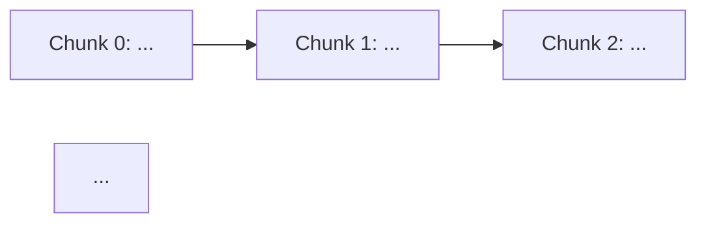

# Macro Plan Reference

Macro plans are high-level investigation and architecture documents. They scope the problem, map the current system, and propose a concrete approach. They are the source of truth for *what* and *why* — the micro plans handle *how*.

## Template

````markdown
# <Title>

## Summary
What this plan achieves in 2-3 sentences.

### Invariants
Numbered list of rules that must always hold true.

---

## Current Architecture (What Exists Today)
Brief description of the current system, key files, data flows, and problems with the current approach.

---

## Proposed Architecture
Concrete description of the target state:
- New/changed data models (tables, fields, indexes)
- New/changed workflows and their steps
- Error handling by failure point (table format: failure | has side effects? | recovery)
- Edge cases and how they're handled

---

## Implementation Chunks



### Chunk 0: <Name>
What this chunk does. Files to change and what changes in each.

### Chunk N: ...

---

## Cross-Cutting Concerns
### CCN — <Short description>
Issues that span multiple chunks (race conditions, migration strategy, decoupling, etc.)
````

## Field Guidance

- **Problem**: One sentence. State the invariant that's violated or the failure mode.
- **Fix**: Concrete code-level suggestion. Name the error type, the message, the file to change.
- **Recovery**: What happens after the error — user retry, admin action, redirect, support link.
- If the fix requires a product decision, prefix with: `(Decision needed)`

## Existing Infrastructure Table

When documenting the current system, include a table of existing infrastructure:

```markdown
| Layer | Tool | Location |
|-------|------|----------|
| ... | ... | `path/to/file.ts` |
```

## Diagrams

Use mermaid diagrams where they genuinely clarify architecture. Don't add them for content that's already clear from a table or list.

**When to use diagrams:**

| Diagram type | Mermaid syntax | Good for |
|---|---|---|
| State machine | `stateDiagram-v2` | Status lifecycles, order/payment states |
| Workflow pipeline | `flowchart TD` | Multi-step processes with branching failure paths |
| Before/after comparison | Paired `sequenceDiagram` blocks | Showing current vs proposed data flow side by side |
| Decision tree | `flowchart TD` | Error recovery logic, onComplete handlers |
| Dependency graph | `flowchart LR` | Chunk ordering in Implementation Chunks section |

**When NOT to use diagrams:**
- Simple linear sequences (just use a numbered list)
- Field/index tables (already tabular)
- Anything with <4 nodes and no branching

**Tips:**
- Use color coding for error severity: `style Node fill:#fee,stroke:#c33` for errors, `fill:#efe,stroke:#3a3` for success
- Use `---\ntitle: "Descriptive title"\n---` in sequence diagrams to label before/after comparisons
- Keep flowcharts readable — if a diagram has >12 nodes, split it or simplify
